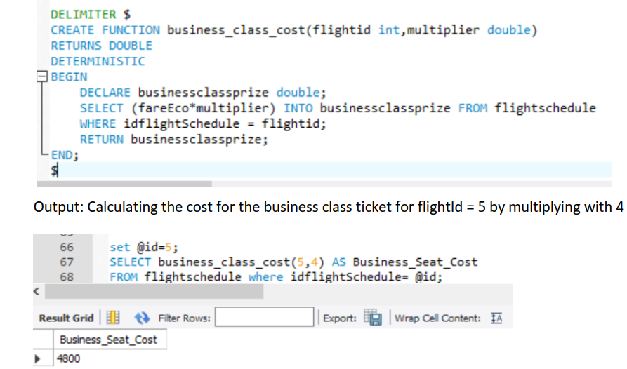
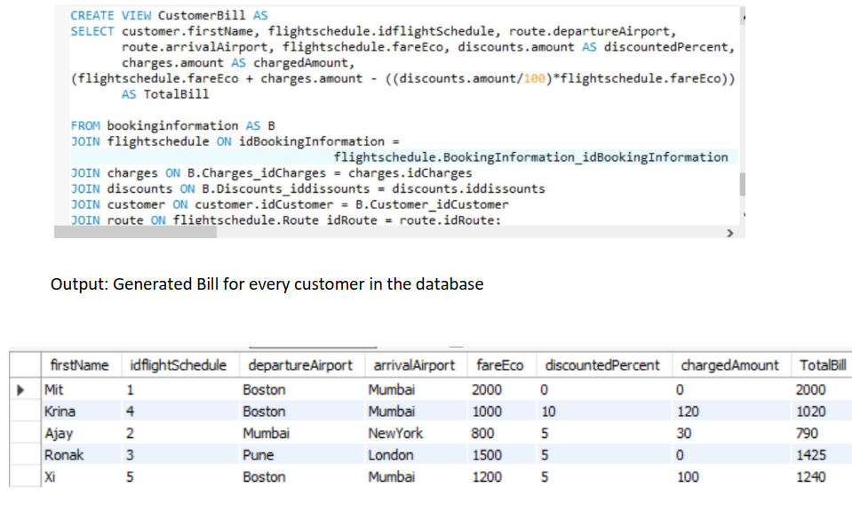
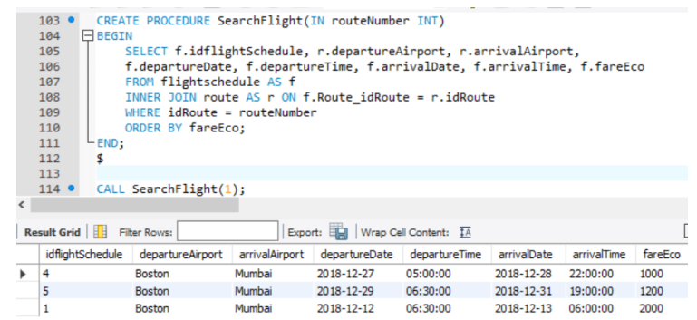

# Database-Design-Airline-Company

**Summary:**
- The goal of the project is to build a database system for an airline company to manage its flight bookings, customers and schedules. 
- It a system which is dependent on time and money as customers will be paying to book their seat, so a relational database system is essential.
- To manage thousands of transactions per day, avoid overbooking of flights and provide more
flexibility to the customers an online Airline Reservation System is required

**Implementation:**

**1) Triggers**
- On INSERT INTO seats table the total available seat for business or economy class in flightSchedule table decrements by one
- ON UPDATE to type of seats in the seats table, the corresponding available seats in flightSchedule will increment or decrement accordingly
Example: If a user updates his seat type from Economy to Business class than corresponding total number of available seats are updated for each seat type in flightSchedule table

**2) User Defined Functions**
- business_class_cost(): This function can be used to calculate the cost of a seat of type business class by multiplying a number with the price of economy class ticket. This
number and flight id is given as input to the function

- flights_on_schedule(): It calculates the number of flights which are currently scheduled by checking the status flag on every row in flightschedule table

**3) View**
- generate a customer bill for customer after considering any available discounts or extra charges

**4) Stored Procedure**
- Searching for the best flight is a common application for most airline companies and that is what customers are looking for. Here the function takes an input as a route number which contains the departure and
arrival locations and returns all the flights with the same location with lowest fare first

**5) User Privileges**
- Customer has been given a privilege to access the view to generate final bill and flight schedule table. 
- The airline employees have access to customer data, flight schedule and booking information.

**6) Index**
- Created an index to fareEco column in flightschedule table, amount column in discount and charges table as these columns are used frequently for calculations and analysis.

**7) Transactions**
-  READ ONLY access given as customer should not be able to edit flight schedule information table
